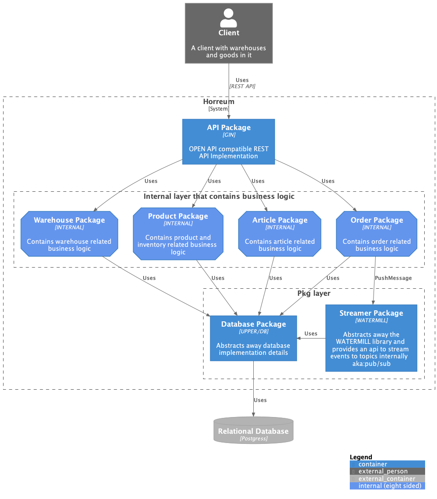

#  Horreum

From Wikipedia, the free encyclopedia;

> *A **horreum** (plural: horrea) was a type of public warehouse used during the ancient Roman period.*
> Although the Latin term is often used to refer to granaries, Roman horrea were used to store many other types of consumables; the giant Horrea Galbae in Rome were used not only to store grain but also olive oil, wine, foodstuffs, clothing and even marble...
>
> https://en.wikipedia.org/wiki/Horreum

Following the ancient Roman correspondence Horreum, is an application to manage products and their stock informations.

# Contents

1. [Architectural Design](#architectural-design)
2. [Project structure](#project-structure)
3. [Database Diagram](#database-diagram)
4. [Installation & Usage](#installation--usage)
5. [Key Concepts](#key-concepts)

   5.1 [Services](#services)

   5.2 [Server](#server)

   5.3 [Rest API](#rest-api)

   5.4 [Events](#events)

   5.5 [Migrations](#migrations)

   5.6 [Testing](#testing)


## Architectural Design

Every application prone to the architectural changes while time goes on and needs changes
and Horreum no exception to that, to address those concerns Horreum uses [C4 Modelling](https://c4model.com/).

In order to keep the architectural changes manageable over time, I've used [C4-PlantUML](https://github.com/plantuml-stdlib/C4-PlantUML/)
to document architectural structure, they can be found under `docs/c4model` folder.

For the sake of the demo I only designed `System Context` and `Container` Level.

| 1.System Context                                            |                            2.Horreum Container                             |
|-------------------------------------------------------------|:--------------------------------------------------------------------------:|
|  |  |


## Project Structure

Horreum uses [Standard Go Project Layout](https://github.com/golang-standards/project-layout) for the structural design.

## Database Diagram


## Installation & Usage

If you have the docker installed you can just run the command below, and it will do the rest
```
docker-compose up
```

After you complete the installation steps Horreum spins up an http server
at the port `8080` you can just hit the link below to get start to use swagger:

http://localhost:8080/swagger/index.html


## Key Concepts


### Services
There are 4 internal services:

- WarehouseService
- OrderService
- ArticleService
- ProductService

Which implements their own interfaces:

- WarehouseRepository
- OrderRepository
- ArticleRepository
- ProductRepository

All the services implements CRUD operations over their related Struct.


### Server

`api/server` package lets Horreum to spin up a HTTP and a Streaming server.

To handle the dependency injection it also introduces a Handler struct which
can be used through the application runtime.

```golang
type Handler struct {
	WarehouseService *warehouse.WarehouseService
	OrderService     *order.OrderService
	ArticleService   *article.ArticleService
	ProductService   *product.ProductService
}
```

### Rest API

Horreum uses Open API as api standard, every controller needs to have open api specs included
by design, to give you a quick info you can see the below:

> What is the OpenAPI Specification?
>
> The OpenAPI Specification, formerly known as the Swagger Specification, is the world’s standard for defining RESTful interfaces. The OAS enables developers to design a technology-agnostic API interface that forms the basis of their API development and consumption.
>
> https://swagger.io/solutions/getting-started-with-oas/


### Events

Aside from the CRUD operations; Horreum spins up an streaming message bus over channels
this helps Horreum to be more event driven.

Thus OrderService publishes a new Event whenever one of the below happens:

- OrderCreated
    - Handler: Decreases the product stock information accordingly
- OrderUpdated
- OrderDeleted
    - Handler: Increases the product stock information accordingly

To provide streaming bus feature Horreum uses the `github.com/ThreeDotsLabs/watermill`
projects and wraps that under the `pkg/streamer` package.

### Migrations

Horreum uses `pkg/dbclient` package to handle migrations and database related tasks.

`dbclient` under the hood wraps up `github.com/upper/db/v4` package and provides orm-like
api to internal application.

Another aspect of the database is of course the managing the migrations, to do that
Horreum uses `github.com/pressly/goose/v3` package to manage them.

All the generated migrations can be found under the `pkg/dbclient/migrations` folder.

### Testing

Horreum uses `github.com/stretchr/testify` to handle assertion inside the tests
no need to mention that mocking is another important aspect of the testing to handle
that need Horreum uses `github.com/vektra/mockery` library which can automaticaly generate
mocks over existing interfaces.
